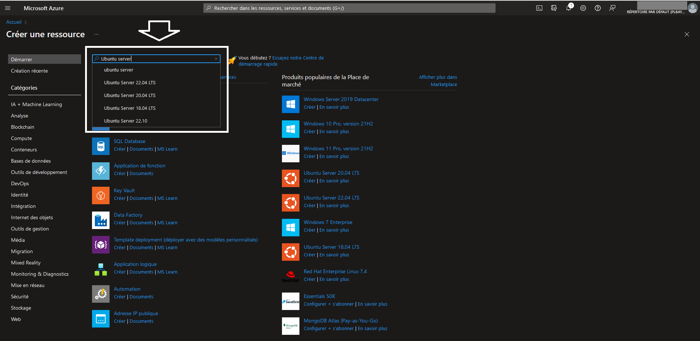
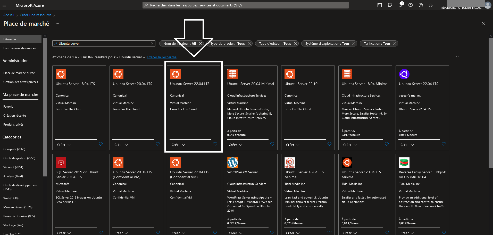
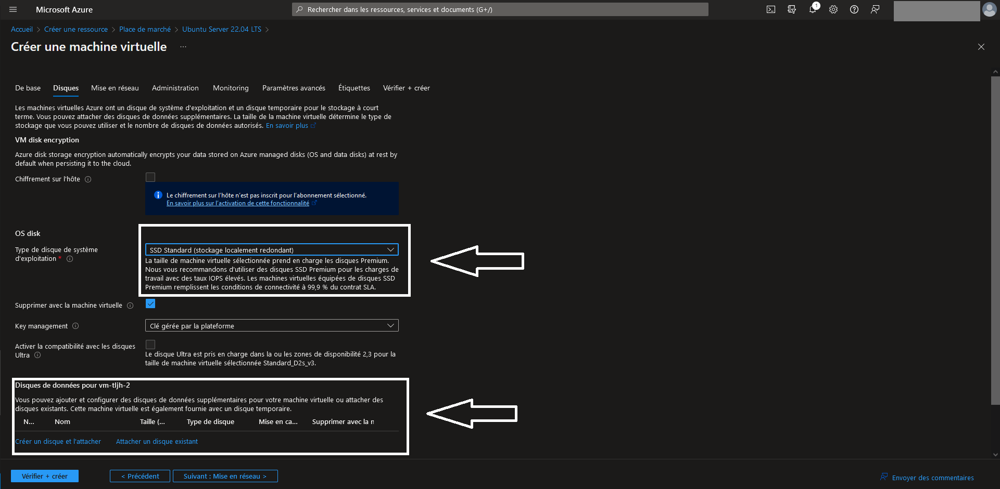
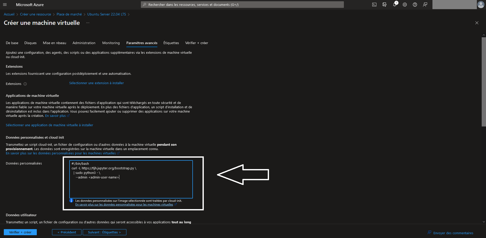
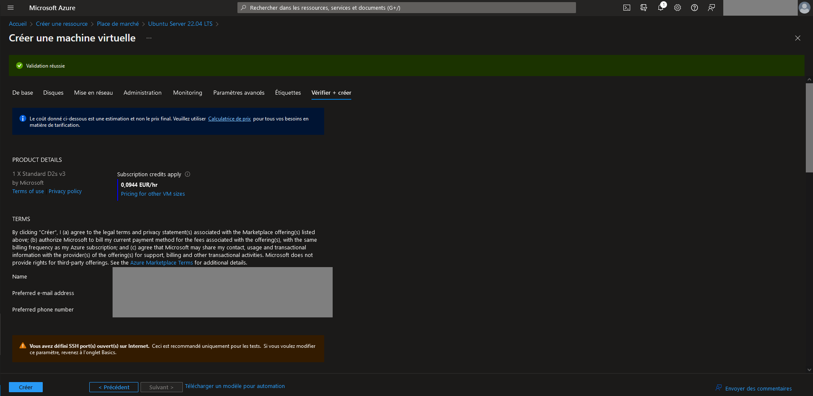
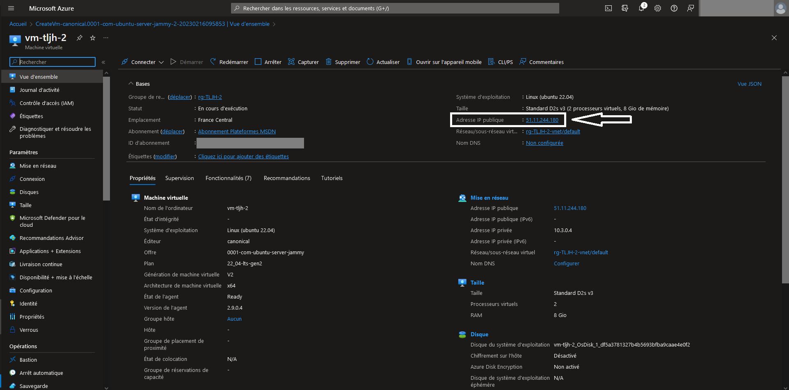
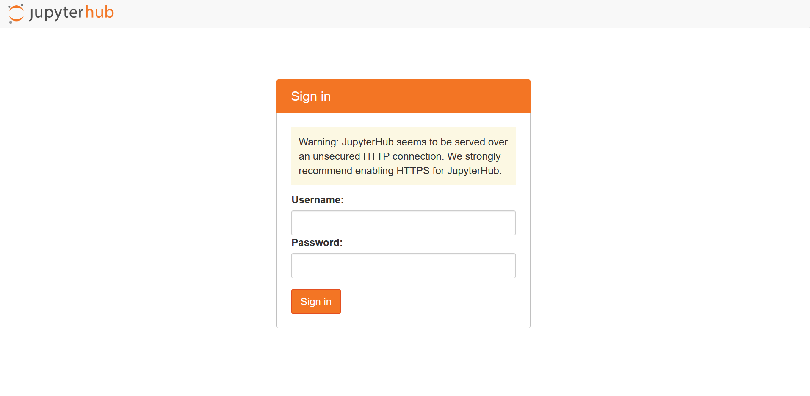
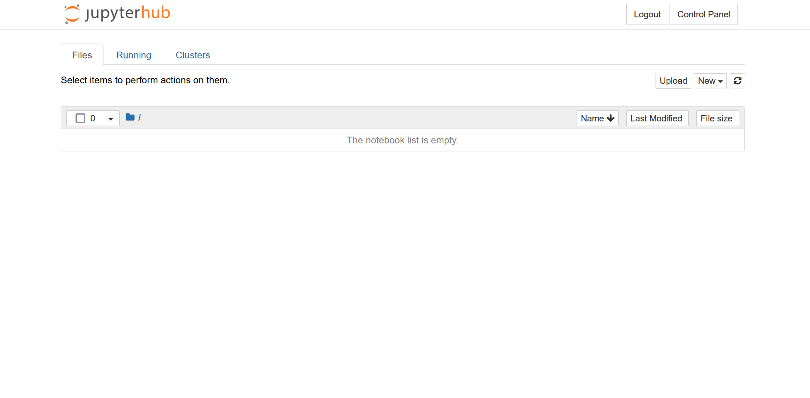
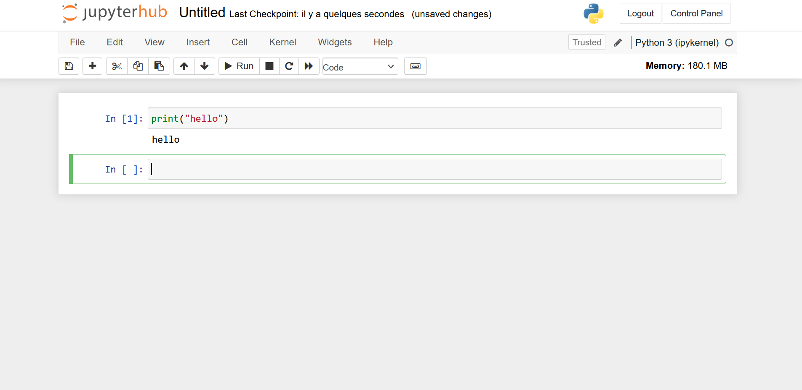
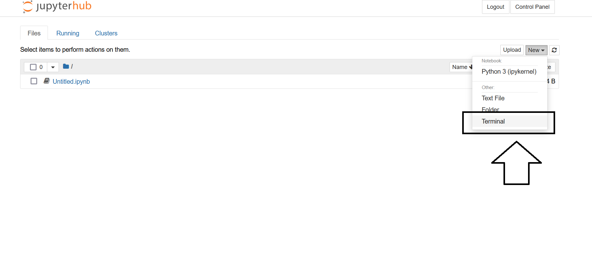

# Où et comment installer TLJH ?

L'installation de TLJH peut s'effectuer sur toute machine virtuelle avec système d'exploitation **Ubuntu Server 18.04 ou plus récent**. Je vous présente ici l'installation sur **Azure** mais cette installation est aussi possible sur les **autres fournisseurs de cloud** (AWS, GCP, OVHCloud, Scaleway...).

```{warning}
Avec l'utilisation du cloud, on peut vite avoir des **surprises sur la facturation**. Je vous conseille donc de bien vérifier que l'**arrêt automatique** est activé. Normalement, il est mis en place par défaut à 19h.

Par contre, même si la **majeure partie du coût** de la machine virtuelle provient de la **puissance de calculs (compute)**, il reste d'**autres sources de coûts** plus faibles (stockage, réseau...).
```

# ☁️ Installation sur Azure

```{admonition} Documentation officielle
Pour ceux qui maitrisent bien l'**anglais**, vous pouvez aussi utiliser cette ressource : https://tljh.jupyter.org/en/latest/install/azure.html

Pour les **autres fournisseurs de cloud** ou une installation sur un **serveur privé**, vous pouvez utiliser cette ressource : https://tljh.jupyter.org/en/latest/install/index.html
```

Ce tutoriel se concentre sur l'installation à l'aide de l'**interface graphique** d'Azure. 

## Etape 1 : connexion au portail d'Azure

Vous devez arriver sur une **page d'accueil** qui ressemble à cela (peut-être avec un fond clair suivant les réglages de votre interface).


## Etape 2 : choix de la machine virtuelle

Pour créer une machine virtuelle, cliquez sur **"Créer une ressource"**.


TLJH doit être installé sur un **serveur Ubuntu**. Recherchez Ubuntu server dans la barre de recherche :



La **version** d'Ubuntu serveur doit être **ultérieure à 18.04**. Vous pouvez prendre la version **22.04 LTS** :



Pour accéder au paramètrage de la machine virtuelle, cliquez sur **"Créer"** :


## Etape 3 : paramètres généraux

Après avoir cliqué sur "Créer", vous arrivez sur cet **écran de paramètrage** de la machine virtuelle **Ubuntu Server 22.04 LTS** :


Dans l'onglet des **paramètres de base**, vous devez remplir les élèments suivants :

```{admonition} Information
Les **paramètres non listés** doivent être laissés à leur **valeur par défaut**. Pour plus de détails, vous pouvez regarder cette **vidéo** : [](https://www.youtube.com/watch?v=x-MJwweK0Mw "The Littlest JupyterHub - Partie 1 - Installation sur Azure")
```

- *Abonnement* : selectionnez le compte qui sera **facturé** pour cette machine virtuelle

- *Groupe de ressources* : choisissez un nom qui vous permet de retrouver facilement l'**ensemble des ressources** liées au JupyterHub. Par exemple, `rg-TLJH`

- *Nom de la machine virtuelle* : choisissez un nom qui vous permet de retrouver facilement la **machine virtuelle** dans le groupe de ressources. Par exemple, `vm-TLJH`

- *Région* : ce paramètre correspond au **datacenter** dans lequel sera déployée la machine virtuelle. Choisissez celui le **plus proche de vos utilisateurs** pour diminuer la latence.

- *Options de disponibilité* : ce paramètre correspond à la **redondance** nécesssaire à machine virtuelle si votre utilisation est **critique**. Dans le cadre de la formation, c'est rarement le cas donc on peut sélectionner **"Aucune redondance d'infrastructure requise"**.

- *Taille* : ce paramètre correspond à la **taille de la machine virtuelle**. Ce choix a un **fort impact** sur la **facturation** finale. Dans la **documentation officielle**, il est préconisé de choisir **2 Go de RAM par utilisateur**. Ce choix peut être **modifié après la création**. On peut commencer avec une machine virtuelle de **8 Go de RAM** (exemple : "Standard_D2s_v3").

- *Type d'authentification* : il faut choisir **"Mot de passe"** pour pouvoir **se connecter directement** au JupyteHub après le lancement de la machine virtuelle.

- *Nom d’utilisateur* : ce **nom** sera à utiliser pour se **connecter au JupyterHub**

- *Mot de passe* : ce **mot de passe** sera à utiliser pour se **connecter au JupyterHub**

- *Confirmer le mot de passe* : **même mot de passe** qu'au paramètre précédent

- *Sélectionner des ports d'entrée* : ajouter les ports **80** pour la connexion **HTTP** et **443** pour la connexion **HTTPS**

## Etape 4 : stockage

Après avoir défini les paramètres généraux, on peut passer aux paramètres liés au **stockage**. Cliquez sur l'onglet **"Disques"**



Pour le paramètre **"Type de disque de système d'exploitation"**, vous pouvez choisir **"SSD standard"** qui est **suffisant** dans le cadre de la formation.

Si vous souhaitez utiliser des **jeux de données de tailles importantes**, vous pouvez **ajouter un disque de données**. Sinon, vous pouvez vous contenter du **disque du système d'exploitation** pour ajouter vos données.

## Etape 5 : script de démarrage

Après avoir défini les paramètres du stockage, on peut passer aux **paramètres avancés**. 



Dans la partie **"Données personnalisées"**, vous devez ajouter le **script de démarrage** qui permet l'**installation de TLJH** sur la machine virtuelle. Vous pouvez **copier/coller** le code suivant en remplaçant `<admin-user-name>` par le **nom d'utilisateur** que vous avez défini dans le partie **"paramètres généraux"** :

```bash
#!/bin/bash
curl -L https://tljh.jupyter.org/bootstrap.py \
  | sudo python3 - \
    --admin <admin-user-name>
```

## Etape 6 : création de la machine virtuelle

Après avoir défini les paramètres avancés, on peut passer à l'onglet **"Vérifier + créer"**.



Si tout a été **rempli correctement**, vous devez voir apparaître un **bandeau vert** avec la mention **"Validation réussie"**. Dans ce cas, vous pouvez cliquer sur **"Créer"** en **bas à gauche** de l'écran.

## Etape 7 : vérification du fonctionnement du Jupyter Hub

Au bout de quelques minutes, vous devez voir apparaître l'écran suivant avec le message **"Votre déploiement a été effectué"**. Ceci vous indique que la machine virtuelle a été **déployée**. Par contre, il faut encore **attendre quelques minutes** pour le script d'installation du JupyterHub **s'installe complétement**.


Vous pouvez cliquer sur le bouton **"Accéder à la ressource"** qui vous amène sur cette page :



Il vous suffit de récupérer l'**adresse IP publique** de votre machine virtuelle puis de la coller dans la **barre d'url** de votre **navigateur**. Vous devez arriver sur cette page :



```{warning}
Si vous avez un **message d'erreur**, cela peut venir du fait que l'installation de TLJH n'est **pas terminée** sur la machine virtuelle.
Si vous souhaitez accéder aux **logs** pour **résoudre le problème**, vous pouvez vous connecter en **SSH** avec l'**identifiant** et le **mot de passe** admin de la machine virtuelle et **exécuter la commande** suivante dans le terminal :
`sudo journalctl -u jupyterhub`

Pour plus d'informations sur la **résolution des problèmes**, vous pouvez regarder la **documentation officielle** : https://tljh.jupyter.org/en/latest/troubleshooting/index.html
```

Vous pouvez taper votre **nom d'utilisateur** et votre **mot de passe** définis à la **création de la machine virtuelle**. Vous devez voir apparaitre l'interface de **Jupyter Notebook** :



Vous pouvez lancer un **Jupyter notebook** pour vérifier que le **noyau Python** fonctionne **correctement** :



## Etape 8 : mise en place de l'HTTPS

Pour mettre en place la connexion en **HTTPS** au JupyterHub, il faut d'abord définir un **nom de DNS** à partir de l'écran d'accueil de la machine virtuelle :


Sur cette page, vous pouvez définir l'**étiquette du nom de domaine** et cliquer sur **"Enregistrer"**:


Vous pouvez ensuite revenir sur la **page d'accueil** de la **machine virtuelle**. En cliquant sur "Actualiser", vous devez voir apparaître le **nom de DNS** que vous avez défini :


Vous pouvez ensuite vous **connecter à cette url**, rentrer votre identifiant d'administrateur dans la fenêtre de login du JupyterHub et **ouvrir un terminal** de cette façon :



Une fois le **terminal** ouvert, vous pouvez **exécuter les commandes suivantes** en remplassant  "you@example.com" par votre **adresse email** et "yourhub.yourdomain.edu" par le **nom de domaine** que vous venez de définir dans Azure :
```bash
sudo tljh-config set https.enabled true
sudo tljh-config set https.letsencrypt.email you@example.com
sudo tljh-config add-item https.letsencrypt.domains yourhub.yourdomain.edu
```


Si vous souhaitez **vérifier** que les commandes ont **bien été enregistrées**, vous pouvez éxécuter la commande suivante :
```bash
sudo tljh-config show
```

Ensuite, vous devez **relancer le proxy** à l'aide de la commande suivante :
```bash
sudo tljh-config reload proxy
```

Après quelques minutes, vous pouvez **revenir sur l'interface d'Azure** pour **redémarrer la machine virtuelle**. Une fois la machine virtuelle relancée, vous pouvez vous connecter au JupyterHub en **HTTPS** (le message d'alerte de connexion en HTTP doit avoir disparu).

```{admonition} Information
Pour plus de détails, vous pouvez regarder cette **vidéo** : [](https://www.youtube.com/watch?v=DLYUHl0a0HA "The Littlest JupyterHub - Partie 2 - HTTPS")

Lien vers la **documentation officielle** : https://tljh.jupyter.org/en/latest/howto/admin/https.html
```