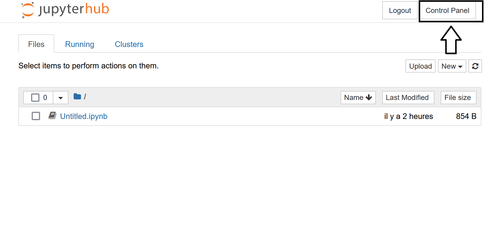
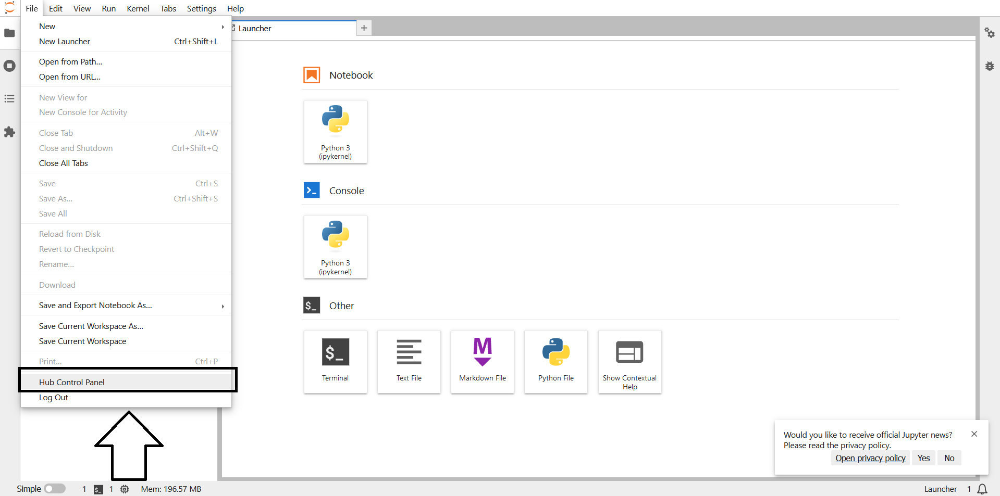
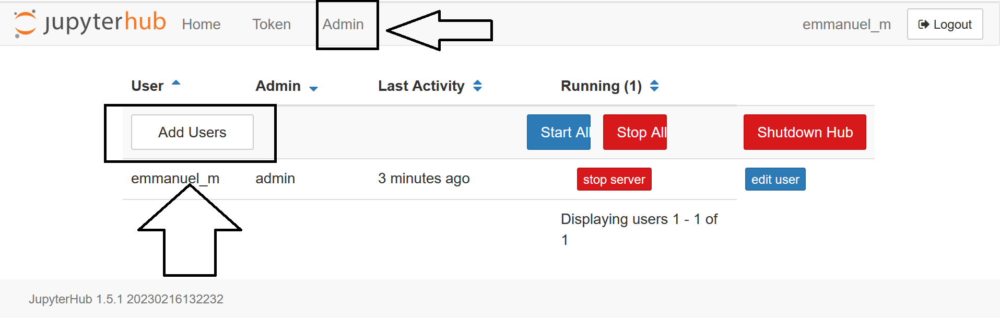
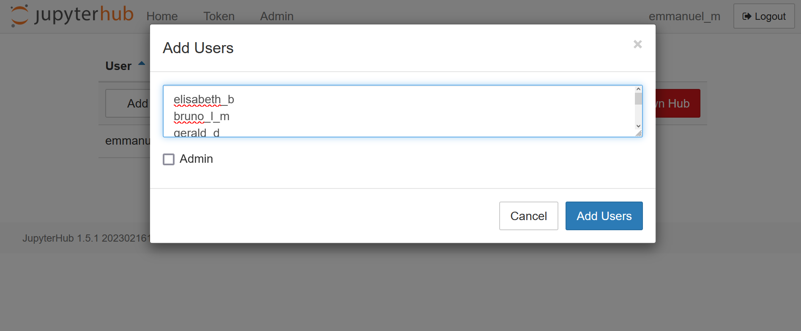
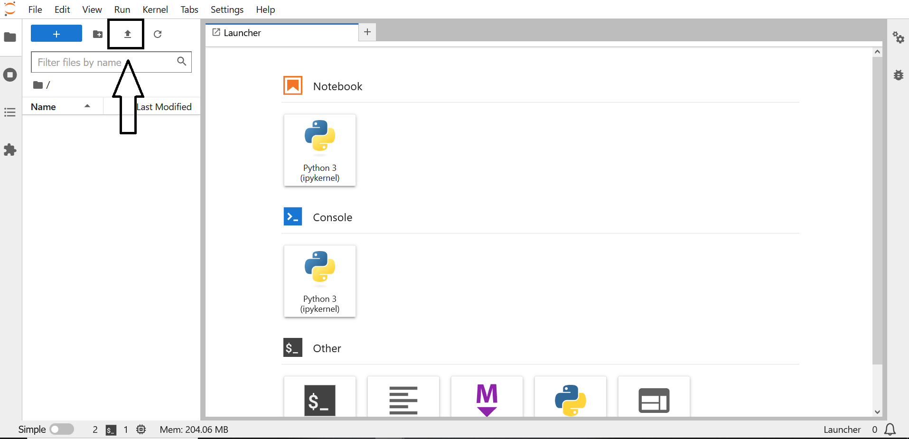

# Comment paramètrer TLJH à votre usage ?

Les actions présentées dans cette partie sont **réalisées directement** dans le **JupyterHub**. Elles sont donc **indépendantes du type de déploiement** que vous avez effectué précédemment (déploiement cloud ou sur serveur privé).

## Comment définir le Jupyter Lab comme interface par défaut ?

Pour définir le **Jupyter Lab** comme **interface par défaut**, il suffit de **modifier le paramètre `user_environment.default_app`** du JupyterHub. Pour cela, il suffit d'ouvrir un terminal dans le JupyterHub et d'éxécuter la commande suivante :
```bash
sudo tljh-config set user_environment.default_app jupyterlab
```
Ensuite, vous devez **relancer le JupyterHub** en éxécutant la commande suivante :
```bash
sudo tljh-config reload hub
```
Vous devez vous **déconnecter** du JupyterHub et en vous **reconnectant**, vous devez vous trouver dans une **interface de Jupyter Lab**.

```{admonition} Information
Pour plus de détails, vous pouvez regarder cette **vidéo** : [](https://www.youtube.com/watch?v=LTjBoBMHf-M "The Littlest JupyterHub - Partie 3 - Jupyter Lab")

Lien vers la **documentation officielle** : https://tljh.jupyter.org/en/latest/howto/env/notebook-interfaces.html
```

## Comment créer des comptes apprenants ?

Pour créer des **comptes apprenants** ou des **comptes formateurs (admin)**, vous devez aller dans la partie **"Control Panel"** en **haut à droite** de l'écran si vous êtes dans l'interface de **Jupyter Notebook** :



Si vous êtes dans l'**interface de Jupyter Lab**, cela se situe dans l'onglet **"File"** :



Dans le **"Control Panel"**, cliquez sur l'onglet **"Admin"**, puis sur "Add Users" :



Il ne vous reste plus qu'à **ajouter votre liste d'apprenants** (un par ligne) :



Vous pouvez maintenant **tester** les nouveaux compte en vous **déconnectant** et en **reconnectant** avec un nom d'apprennant ajouté. Le **mot de passe** est **enregistré à la première connection**.

```{admonition} Information
Pour plus de détails, vous pouvez regarder cette **vidéo** : [](https://www.youtube.com/watch?v=4q5fv4q1kl4 "The Littlest JupyterHub - Partie 4 - Création des comptes apprenants")

Lien vers d'autres méthodes de connexion dans la **documentation officielle** :

- https://tljh.jupyter.org/en/latest/howto/auth/github.html

- https://tljh.jupyter.org/en/latest/howto/auth/google.html
```

## Comment installer des bibliothèques Python ?

Pour **installer des bibliothèques Python**, il vous suffit d'ouvrir un **terminal** dans un compte d'administrateur de JupyterHub et d'exécuter la **commande** suivante :

```bash
sudo -E pip install numpy
```

L'installation des bibliothèques est effectuée dans **tous les espaces du JupyterHub** (apprenants et admin). Vous pouvez le **vérifier** en vous connectant au JupyterHub avec un **compte apprenant**, en ouvrant un notebook et en **important la bibliothèque installée**.

```{admonition} Information
Pour plus de détails, vous pouvez regarder cette **vidéo** : [](https://www.youtube.com/watch?v=PkfJ8a3Z7gw "The Littlest JupyterHub - Partie 5 - Installation des bibliothèques Python")

Lien vers la **documentation officielle** : https://tljh.jupyter.org/en/latest/howto/env/user-environment.html
```

## Comment ajouter du contenu dans TLJH ?

## Sans dépôt Git

Dans l'interface du **Jupyter Lab**, vous pouvez directement **charger des fichiers** (notebooks, jeu de données) en cliquant sur la **fléche en haut à gauche** :



Vous pouvez ensuite ouvrir un **terminal** et **exécuter les commandes** suivantes (en remplacant "nom admin" pour votre nom d'administrateur et "nom apprenant" pour votre nom d'apprenant):
```bash
cd ..
sudo cp jupyter-<nom admin>/Exercice.ipynb  jupyter-<nom apprenant>/Exercice.ipynb
sudo chmod 666 jupyter-<nom apprenant>/Exercice.ipynb
```

Si vous souhaitez effectuer l'**envoi pour tous les apprenants**, vous pouvez exécuter dans le terminal un **script Python** de ce type :

```python
import os
import shutil

def copy_file(students, admin_name="emmanuel_m", file_name="Exercice.ipynb"):
    path = "/home"
    for name in students:
        src = os.path.join(path, f"jupyter-", file_name)
        dst = os.path.join(path, f"jupyter-{name}", f"Exercice_{name}.ipynb")
        shutil.copyfile(src, dst)
        os.chmod(dst, 0o666)
```

Vous pouvez laisser l'apprenant **effectuer l'exercice**. Quand l'**exercice est fini**, vous pouvez le **récupérer dans le terminal** côté formateur avec la commande suivante :
```bash
sudo cp jupyter-<nom apprenant>/Exercice.ipynb jupyter-<nom admin>/Exercice.ipynb
```

Si vous souhaitez **récupérer l'ensemble des exercices** des apprenants pour **éteindre la machine virtuelle** du JupyterHub et **corriger les exercices sur votre ordinateur**, vous pouvez exécuter un **script Python** de ce type dans le terminal :

```python
import os
import shutil

def copy_file(students, admin_name="emmanuel_m"):
    path = "/home"
    for name in students:
        src = os.path.join(path, f"jupyter-{name}", f"Exercice_{name}.ipynb")
        dst = os.path.join(path, f"jupyter-{admin_name}/Results", f"Exercice_{name}.ipynb")
        shutil.copyfile(src, dst)
        print(src, dst)
    shutil.make_archive("results", 'zip', os.path.join(path, f"jupyter-{admin_name}", "Results"))
```

```{admonition} Information
Pour plus de détails, vous pouvez regarder cette **vidéo** : [](https://www.youtube.com/watch?v=_2HppKAQzBs "The Littlest JupyterHub - Partie 6.0 - Ajout des ressources de formation (sans Git)")
```

## Avec un dépôt Git

La bibliothèque Python [`nbgitpuller`](https://hub.jupyter.org/nbgitpuller/) permet de **distribuer du contenu de formation** directement dans les espaces du **JupyterHub** à partir d'**un dépôt Git**.

Tout d'abord, il faut **installer la bibliothèque [`nbgitpuller`](https://hub.jupyter.org/nbgitpuller/)** dans le JupyterHub. A partir d'un terminal d'un **compte administrateur** du JupyterHub, exécutez la commande suivante :

```bash
sudo -E pip install nbgitpuller
```

Ensuite, il faut créer un **dépôt Git** (sur Gitlab ou Github par exemple) avec le **contenu de la formation**. Il ne reste plus qu'à **générer le lien** à transmettre aux apprenants pour que les contenus des espaces du JupyterHub soient **automatiquement mis à jour** depuis le dépôt Git. Ceci s'effectue facilement à cette adresse : https://hub.jupyter.org/nbgitpuller/link

```{admonition} Information
Pour plus de détails, vous pouvez regarder cette **vidéo** : [](https://www.youtube.com/watch?v=_pwkW4dQtSk "The Littlest JupyterHub - Partie 6.1 - Ajout des ressources de formation (avec Git)")
```